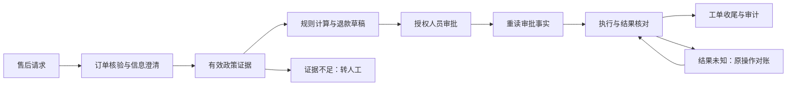

# OpsPilot · 电商售后数字化工具

> 个人开发项目，围绕电商退款工单开展流程设计、可靠性验证与业务更新尝试。
> 文档更新：2026-09-16；最近一次已记录的完整业务回归：2026-09-13。

OpsPilot 将售后请求整理、订单核验、政策查证、退款草稿、人工审批和处理记录串成可追踪的工作流程。
项目面向电商内部售后坐席，探索如何用数字化工具减少信息反复核对、明确处理责任，并为后续企业业务拓展提供可验证的设计基础。
当前以退款工单为已实现主线；退换货、补发、物流接入和客户自助服务均不能视为已完成能力。

项目使用固定种子的合成业务样本开展开发和验证，尚未接入真实支付、生产 CRM 或企业客户数据。
实际运营效率、企业收益、真实模型效果及生产性能均未实测。

## 电商售后业务场景

| 业务问题 | 当前处理方式 | 业务设计目的 |
| --- | --- | --- |
| 售后描述不完整、缺少订单号 | 保留原工单上下文并请求补充信息 | 减少依据不全时的错误处理 |
| 退款理由需要匹配政策 | 检索租户内有效政策，保留文档版本与引用位置 | 让处理依据可以复核 |
| 退款金额与资格需要核算 | 由确定性领域服务读取订单事实并计算 | 避免语言模型自行决定金额 |
| 退款需要责任人确认 | 先创建动作草稿，授权人员提交带版本的审批决定 | 明确申请、审批和执行的职责 |
| 请求重复或外部结果暂时不明 | 同键同载荷复用结果；未知结果按原操作对账 | 控制重复退款风险 |
| 工单中断、工具失败或越权请求 | 按状态等待、拒绝、恢复或转人工，保留审计记录 | 使异常处理具有明确出口 |

## 业务流程与职责



- **Agent 工作流**：理解请求、澄清信息、编排只读检索、组织处理步骤与解释结果。
- **确定性领域服务**：裁决金额、资格、权限、状态、幂等、并发和审计；错误码按原义返回。
- **授权人员**：审批退款草稿；模型输出或自然语言中的“同意”不能替代审批决定。
- **PostgreSQL**：持久化业务事实。LangGraph checkpoint 仅保存流程恢复状态。
- **本地工作台**：通过受保护接口查看工单、证据、审批状态和处理轨迹；当前采用合成数据及本地身份配置。

## 当前能力与验证范围

| 能力 | 状态 | 依据与限制 |
| --- | --- | --- |
| 退款工单闭环 | 已实现并验证 | 信息澄清、政策检索、草稿、审批恢复、异常对账及收尾；合成黄金集 11/11 |
| Agent 生命周期 HTTP 接口 | 已实现并验证 | `start / clarify / decision / state`；当前 31 项 HTTP 用例、7 项 PG 接入用例 |
| 数据库存储与重启恢复 | 已实现并验证 | PG 命令事务、线程租约及固定 checkpoint；5 项重启恢复用例，包含独立进程接续 |
| 权限、幂等与敏感信息保护 | 已实现并验证 | 租户隔离、带版本审批、重复请求校验、公共视图白名单与脱敏 |
| 审计事件持久标识 | 已实现并验证 | 数据迁移 `0006` 增加 `event_id`；历史无 ID 对象仍保留兼容读取 |
| 循环控制与工具去重 | 已实现并验证 | 默认节点步数上限 32；审批事实重读不缓存；安全停止终态写入 checkpoint |
| 本地政策检索 | 已实现并验证 | 有效版本、适用范围、引用定位、注入拒绝与无证据转人工 |
| LLM 适配与质量评估入口 | 实现完成，离线验证 | 真实模型和真实 Judge 未实测；缺少安全配置时降级离线，不发送网络请求 |
| 多角色只读编排 | 可选业务更新实验 | 合成集合内与单 Agent 正确性持平，尚无已测业务收益，默认仍为单 Agent |
| 客户自助、退换货、补发、真实物流 | 规划 / 未接入 | 需要分别设计业务状态、权限、数据来源及验收场景 |
| 微调、生产部署及真实外部写入 | 未运行 / 未实现 | 不能用本地合成样本结果代替真实系统验证 |

用例数在 2026-09-16 通过收集检查核对，收集检查不等同于重新执行测试。
完整状态见[项目状态与风险](./docs/STATUS_AND_RISKS.md)。

## HTTP 业务接入

`create_app(..., agent_runner=...)` 将 `WorkflowRunner` 接入 FastAPI；接口与领域服务共享业务规则。
未装配运行器时返回 `503 AGENT_RUNNER_UNAVAILABLE`。

| 接口 | 身份 | 行为与失败条件 |
| --- | --- | --- |
| `POST /api/v1/agent/start` | AGENT | 启动流程；租户取认证身份；同线程异请求返回 409；额外权限或金额字段返回 422 |
| `POST /api/v1/agent/{thread_id}/clarify` | AGENT | 仅在澄清状态接受补充信息；空载荷 422，状态不符 409 |
| `POST /api/v1/agent/{thread_id}/decision` | APPROVER / SYSTEM | 空请求体即可触发恢复；重读已提交的审批或执行事实；携带审批结论字段返回 422 |
| `GET /api/v1/agent/{thread_id}/state` | AGENT / APPROVER / SYSTEM | 返回脱敏公共视图；错误租户与不存在线程统一返回 404 |

这些接口只服务内部坐席，同租户客户身份调用也会被拒绝。审批先通过
`/api/operations/{operation_id}/approve` 或 `reject` 写入领域事实，再触发工作流恢复。
外部结果不能通过 `start` 请求指定；本地未知状态验证由授权 SYSTEM 经领域执行入口写入模拟超时。

线程按 `(tenant_id, thread_id)` 隔离，checkpoint 使用长度编码键；旧键只有在嵌入身份精确匹配时才可读取。
PG 下可在租约到期后，由新进程使用同一数据库与 checkpoint 接续处理。该验证覆盖顺序重启恢复，
不代表多实例并发部署已通过验证。收尾遇到 `executed / rejected / failed / unknown` 时按领域状态分别处理，
不重复执行退款，不把收尾失败改写成成功。详见[架构设计](./docs/ARCHITECTURE.md)。

## 本地使用

在项目根目录启动 PowerShell，先设置项目运行时目录，再启动本地工作台：

```powershell
. .\scripts\init_d_env.ps1
.venv\Scripts\python.exe scripts\run_api.py --backend memory --port 8080
# 浏览器访问 http://127.0.0.1:8080/
```

`memory` 使用进程内合成数据，重启后重置；工作台的场景重置只作用于该模式。
`pg` 模式使用 PostgreSQL 与固定 checkpoint，不注册 `/api/demo/reset`，也不会自动填充业务数据。
数据库准备、隔离测试和启动要求见 [PostgreSQL 使用说明](./docs/POSTGRES.md)。

工作台的“案件处置 → Agent 全链路”显示工单、操作编号、政策引用、审批等待、处理结果、错误码与审计标识。
可依次检查正常退款、缺失信息、审批拒绝、未知结果对账、跨租户拒绝与循环停止。
“Agent Lab”用于隔离验证信息澄清、政策不匹配、跨租户访问和敏感字段脱敏；不能据此推断真实客户系统已接通。

## 可复现验证与已记录结果

```powershell
. .\scripts\init_d_env.ps1
.venv\Scripts\python.exe -m pytest tests -q
.venv\Scripts\python.exe scripts\demo_agent_http.py
.venv\Scripts\python.exe scripts\verify_after_sales.py
.venv\Scripts\python.exe scripts\demo_rag_policy.py
.venv\Scripts\python.exe scripts\demo_modes.py
.venv\Scripts\python.exe scripts\demo_supervisor_trace.py --mode multi_agent
.venv\Scripts\python.exe evals\replay.py --dataset golden_v1
.venv\Scripts\python.exe evals\compare_modes.py
.venv\Scripts\python.exe evals\run_model_shadow_eval.py --mode offline
.venv\Scripts\python.exe evals\run_llm_judge.py --mode offline
```

脚本、接口和数据集名称是现有技术标识，命令按仓库实际路径保留。
2026-09-13 的记录：离线全量 **502 passed / 55 skipped / 1 warning**；
隔离 PostgreSQL 迁移至 `0006` 后 **557 passed / 0 skipped / 1 warning**。
当时离线跳过项包含未启用的 PG 集成及数据库迁移条件未满足的运行时检查；不能将跳过项当作通过。
边界验证为 memory 6 项加 PG 1 项通过；黄金集 11/11，模式对照在该合成集合内持平。

以上是历史运行证据。本次整理文档、报告标题与业务验证入口名称；相关报告回归 11 项、业务场景 7 项通过，
未重跑完整 PG 回归，不新增模型、性能或生产效果结论。
命令前提、完整记录与已知限制见[测试基线](./docs/TESTING_BASELINE.md)及
[可靠性审查记录](./docs/RELIABILITY_REVIEW_2026-09-13.md)。

报告约定：已验证的报告存放 `evals/reports/`；未实测候选模式报告放在 `.runtime/reports/`。
测试使用临时目录，不能改写已有评测报告。真实模型成本缺失时显示 `N/A`，离线 `tokens=0` 不代表真实模型免费。

## 开发环境与业务拓展

本机 `.venv` 和基础解释器位于 D 盘。`scripts/init_d_env.ps1` 仅设置当前 PowerShell 的运行时、
临时目录及缓存位置，写入项目 `.runtime/` 与 `.cache/`，不向 C 盘安装或写项目运行时文件。

后续按“业务闭环 → 确定性边界 → 安全与恢复 → 评测与观测 → 界面体验 → 模型与性能优化”推进。
优先完善故障验证、审计关联和工作台可用性，再依据真实业务需求设计退换货、补发及客户自助流程。
这些企业业务拓展方向目前仅为规划；增加副作用、扩大业务范围或改变事实源须先完成方案确认。
开发规则见 [AGENTS.md](./AGENTS.md)，实施与验收要求见[开发计划](./docs/DEVELOPMENT_PLAN.md)。

## 文档导航

| 文档 | 内容 |
| --- | --- |
| [项目概览](./docs/PROJECT_OVERVIEW.md) | 电商业务背景、使用角色、流程及设计价值 |
| [个人开发与业务设计手册](./DEVELOPMENT_HANDBOOK.md) | 数据、状态、权限、恢复、检索与评测的设计依据 |
| [架构设计](./docs/ARCHITECTURE.md) | 分层、接口、信任边界与运行时限制 |
| [PostgreSQL 使用说明](./docs/POSTGRES.md) | 数据事实源、迁移、隔离验证与恢复 |
| [项目状态与风险](./docs/STATUS_AND_RISKS.md) | 当前能力、未验证项及风险对策 |
| [测试基线](./docs/TESTING_BASELINE.md) | 已记录结果、用例范围与复跑要求 |
| [缺陷回归台账](./docs/DEFECTS_LOG.md) | 业务一致性与可靠性问题的修复依据 |
| [可靠性审查记录](./docs/RELIABILITY_REVIEW_2026-09-13.md) | 历史问题、整改与各轮验证证据 |
| [模型评测](./docs/MODEL_EVALUATION.md) | 受控模型适配、影子验证与成本统计 |
| [多角色编排实验](./docs/MULTI_AGENT_EXPERIMENT.md) | 业务更新实验与默认路径取舍 |
| [开发计划](./docs/DEVELOPMENT_PLAN.md) | 维护优先级与企业业务拓展条件 |
| [维护任务指引](./docs/MAINTENANCE_TASK_GUIDE.md) | 可复用的开发、验证与文档同步任务说明 |
