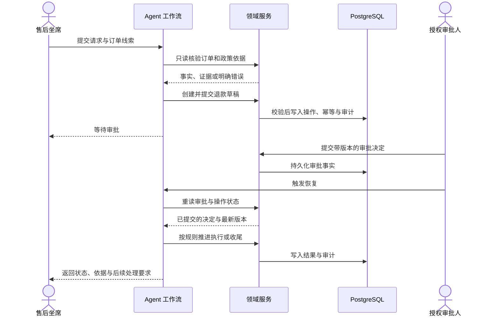

# OpsPilot 电商售后业务与设计概览

> 个人开发的电商售后数字化工具。文档更新：2026-09-16。
> 业务验证使用合成样本；真实企业接入与运营收益尚未验证。

## 项目背景与目标

电商退款处置通常需要同时核对客户描述、订单状态、商品问题、适用政策和审批结果。
信息散落或处理记录不完整时，坐席容易重复查证，异常工单也难以交接。OpsPilot 围绕这一场景，
尝试把信息整理、业务规则和操作记录纳入同一条可追踪流程。

本项目由个人开发，当前以内部售后坐席的退款工单为主线，探索企业业务流程的数字化改造方式。
设计目标包括减少重复核对、明确审批责任、保留政策依据、支持异常转人工和中断后接续。
这些是业务设计目标；尚无真实企业样本支持节省工时、提升满意度或增加收益的量化结论。

## 角色与处理对象

| 角色 / 对象 | 当前职责 | 边界 |
| --- | --- | --- |
| 内部售后坐席 AGENT | 发起流程、补充信息、查看工单状态与证据 | 不能替审批人作出决定 |
| 授权审批人 APPROVER | 对退款草稿提交带版本的同意或拒绝决定 | 不能由工作流请求体伪造身份或决定 |
| 系统身份 SYSTEM | 执行授权的领域操作、记录外部结果及对账 | 当前使用本地合成场景，无真实支付接入 |
| 客户 | 当前作为工单涉及的业务对象 | Agent 生命周期的客户自助入口尚未开放 |
| 工单、订单、退款操作、审批、政策、审计 | 构成处置依据与处理记录 | PG 保存持久业务事实，流程快照不能覆盖它们 |

## 典型退款流程

以合成的商品破损退款请求为例：坐席录入问题，工作流核验订单与租户，检索有效政策；
信息不足时先澄清，证据充分时由领域规则计算草稿。审批人确认后，工作流重新读取审批事实，
再推进执行和收尾。审批被拒绝时不退款；外部结果未知时保留原操作编号，等待对账。

未知结果仅按原操作对账；失败保留工单并转人工。任何路径都不能用解释文本覆盖数据库状态。

## 数字化工具的设计价值

| 设计 | 对应业务需要 | 当前限制 |
| --- | --- | --- |
| 语言处理与业务规则分离 | 同时支持自然语言输入和可复核的金额裁决 | 真实语言模型效果未实测 |
| 政策引用保留版本与位置 | 处理人员可以核对退款依据 | 当前为本地确定性检索与合成政策 |
| 草稿、审批、执行分离 | 建立清晰的责任与授权链 | 未接入企业身份系统 |
| 幂等键、版本校验与事务 | 控制重复退款和并发冲突 | 真实外部支付协议尚未接入 |
| 持久化与重启恢复 | 支持中断后继续处理同一工单 | 验证了顺序重启，多实例并行未验证 |
| 脱敏视图与审计关联 | 查询所需信息并追踪关键动作 | 不是完整的企业数据治理平台 |

默认采用单 Agent。可选的三路证据编排及四角色实验在同一合成黄金集上均为 11/11，
尚未显示相对默认方案的业务收益，因此保留为业务更新尝试。

## 本地业务核查顺序

启动方式见[项目首页](../README.md)。在本地工作台依次核查：

1. 正常退款：查看政策引用、草稿金额、审批事实及收尾结果。
2. 信息缺失：补充信息后继续原线程，确认未另建重复流程。
3. 审批拒绝：确认工单结果与拒绝事实一致，未执行退款。
4. 结果未知：按原操作对账后恢复，确认没有换键重试。
5. 跨租户访问：请求被拒绝，不泄露其他租户的信息。
6. 循环保护：超过步数后转人工，停止继续写入。

上述工作台路径已有接口级运行记录；浏览器自动化回归仍属待完善项。
完整角色、错误码和恢复语义见[架构设计](./ARCHITECTURE.md)。

## 已有证据与后续业务拓展

最近记录的全量回归来自 2026-09-13：离线 502 通过、55 跳过；隔离 PostgreSQL 557 通过、0 跳过。
结果基于本机合成数据，具体环境与历史轮次见[测试基线](./TESTING_BASELINE.md)。
2026-09-16 为文档整理日期，不表示重新进行了全量业务回归。

后续可依据业务需求评估退换货、补发、物流查询与客户自助；每项均需明确适用政策、状态迁移、
权限、库存或资金影响、幂等与审计后再实施。生产身份、真实外部系统、性能容量和运营价值需独立验证。
当前优先处理可靠性与可观测性，详细顺序见[开发与业务更新计划](./DEVELOPMENT_PLAN.md)。
